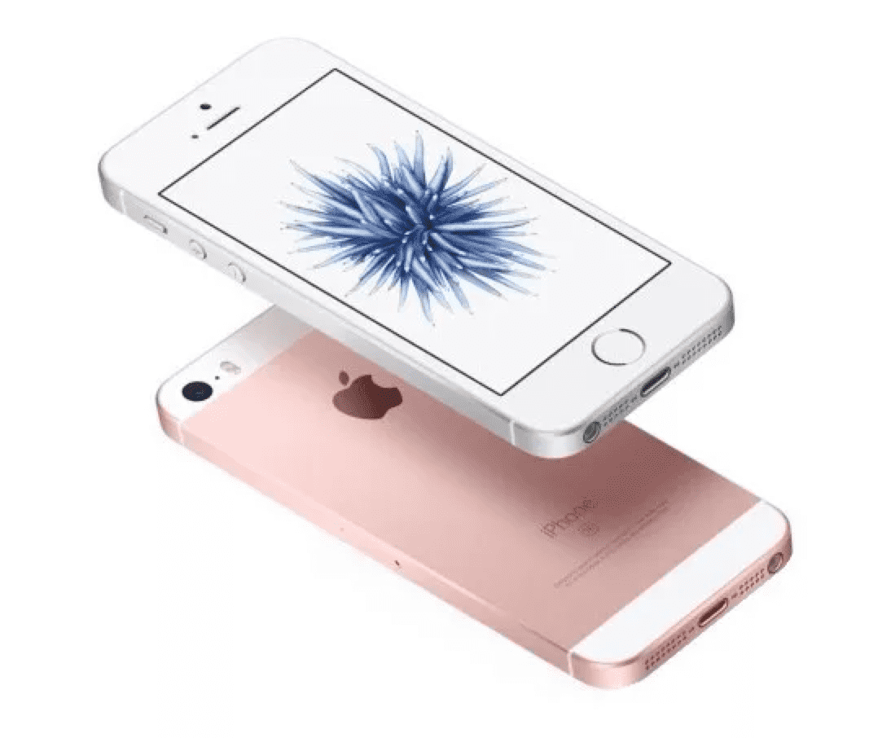

## 王信文开始写公众号了

> 发布日期：2018-02-21

苹果发布iPhoneX之后，作为一个多年的果粉，我纠结了好长时间到底要不要用。纠结的原因是，虽然性能卓越，生态强大，但是iPhoneX的刘海屏和背部凸起的摄像头实在是太难看了。如今三星，小米，华为，甚至锤子都能做出外观上非常优雅且性能完全够用的手机。作为今天全球市值第一的公司，为什么要做出一个屏幕向上放在桌子上都放不平的手机呢。

这让我深刻怀念起有乔布斯的年代。2007年，比尔盖茨曾经说：我愿意放弃很多东西以换取乔布斯的品位。他的最后一代iPhone的设计，到今天看还是非常好看。如果不是屏幕太小，我倒宁愿一直用iPhoneSE。

我鄙视iPhoneX很丑的说法受到了很多朋友的抨击。他们说：“我觉得这样挺好看的啊，习惯习惯就好啊。”这让我开始严肃的思考，品味这个东西，到底是能分出高低，还是不分高低，只有差异？

仔细一想，应该还是有高低啊。今年春节回家，想起很多童年的美食，小学门口的馄饨，初中门口的牛肉面，高中后门的鱼汤丸子。一个个吃过去，发现都远不如童年记忆中的那般美好。应该不是它们都变难吃了，而是我对吃的品味有所提升。

我未满三岁的儿子，最爱看的动画片是《汪汪队立大功》，每天不看几集不要睡觉。我一想，这不就是喜欢超能力吗，喜欢汽车吗，来，给你看这个，皮克斯做的《汽车总动员》。他看了之后，从此爱上闪电麦昆，而且再也不看汪汪队了。所以，品味不仅有高低，而且变高之后，就很难忍受低了。

朋友圈能反映品味。炫耀什么，就是觉得什么东西好，所有品味暴露无遗。前两天看到罗振宇发文章，说过年期间收到很多不认识的人的新年祝福。然后他会翻一下这个人朋友圈，如果发现是个无趣之人，就毫不犹豫的删掉。吓得我赶紧检查了一下自己的朋友圈。

选姑娘也能见品味。今年6月，我看到一个冯小刚的访谈，彼时《芳华》还没有上映。他说到自己选女主角的过程，整容的不要，一身名牌的不要，亲自看了一千个。12月《芳华》上映，看到苗苗，钟楚曦，让我心生佩服，老爷子能一次看一千个姑娘，还保持眼睛不花，着实厉害。在选姑娘方面，品味最好的还是韩寒。无论是《后会无期》里的陈乔恩，还是《乘风破浪》里的赵丽颖，都被韩寒打扮的出奇好看，甚至超越了这些明星的原有人设。

当然，最能见品味的还是作品。品味决定了作品的上限。在作品的品味这点上，文艺青年完败码农。但码农要是文艺起来是最可怕的，简称文艺码农。所以我常常对爱听摇滚、并且把“蓝莲花”作为QQ邮箱登录背景音乐的的张小龙心生感激。如果不是他，我们用的就不是简洁优雅的微信朋友圈，而是花里胡哨、选择性推送的facebook，又或者是漫天雪花的QQ空间。乔布斯的第一份工作是在雅达利公司写游戏代码，因而也能算文艺码农。感谢这些有品位的文艺码农，让我们的生活更美好了一些。

PS 本来这篇文章有另外一个名字。我发给一个写公众号很厉害的朋友看了之后，他说你这个写的比较随笔，一没有什么鲜亮的观点，二没什么有趣的例子，基本属于自High，还不如宣布一下你开始写公众号了，这样比较make sense。好建议，采纳了哈哈。满地打滚求关注哦！

